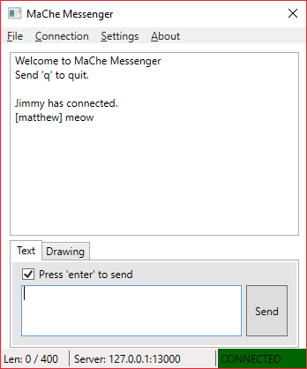
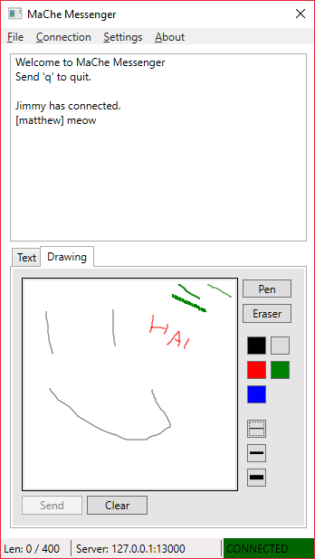
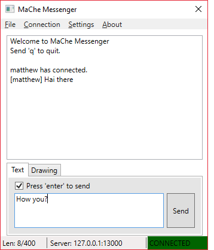
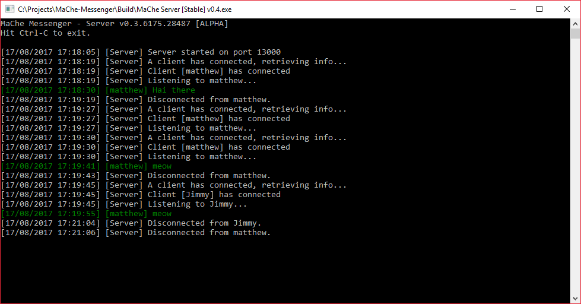

# MaChe Messenger

 

MaChe is a small simple messenging application written in C#. It is designed to send text and images (drawn and written within the client) to other client on a LAN network.

***

All that is required is MaChe server running on the network then multiple clients can connect and chat.

## Download
You can download the current stable release here: [[Github]](https://github.com/Killeroo/MaChe-Messenger/release)

## Features
The project is currently in early development but some core functionality has been implemented.
- [x] Text messages between clients
- [x] Works on LAN networks
- [ ] Sending paint like images between client
- [ ] Autoscan feature

## Instructions

### MaChe Server
Double clicking the MaChe server will start running the server on your pc. Take note of the IP address the server is listening on, this is the address you clients will be connecting too (Auto scan feature will be coming soon!)

### MaChe Client
Like the server, all you need to do is run the client. It will try to connect to the last address that it has saved, the default address and username can be changed at any time in the settings menu 

## Screenshots

Published under MIT

*Written by Matthew Carney [matthewcarney64@gmail.com] =^-^=*
